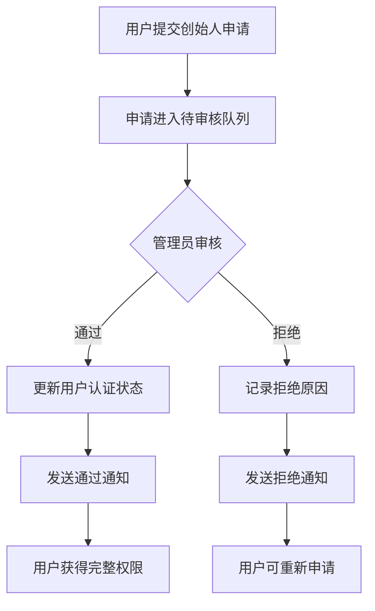
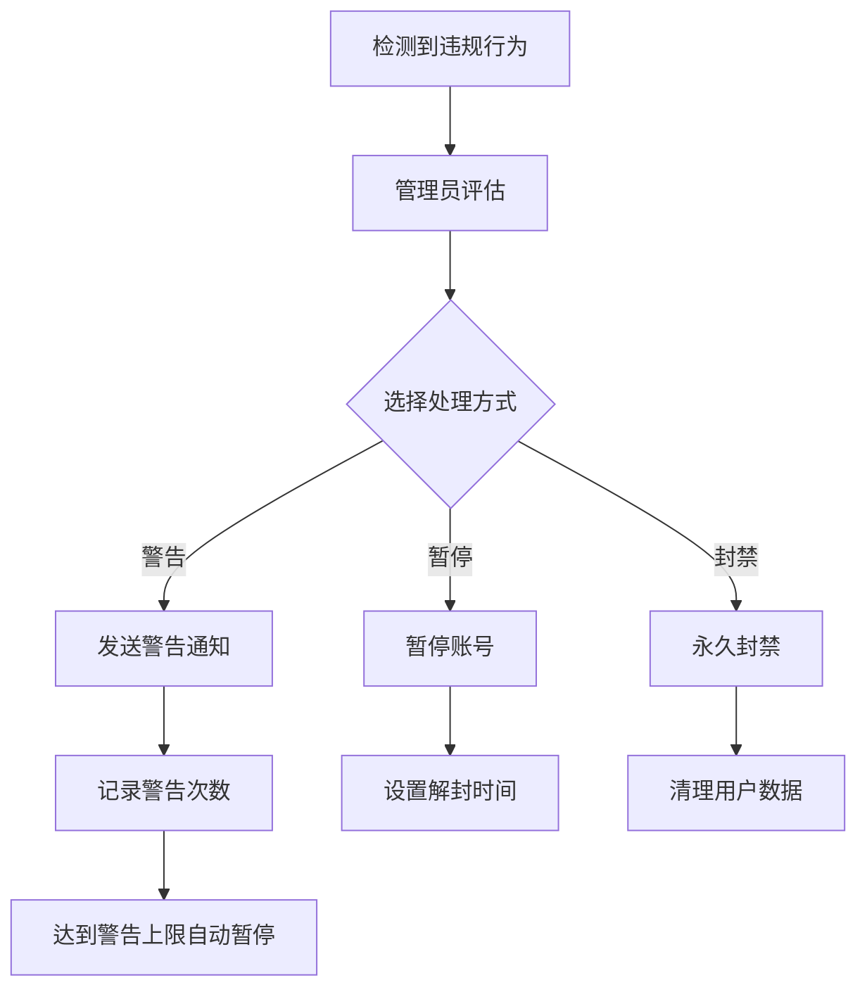
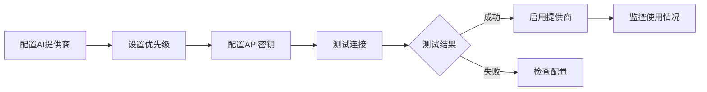
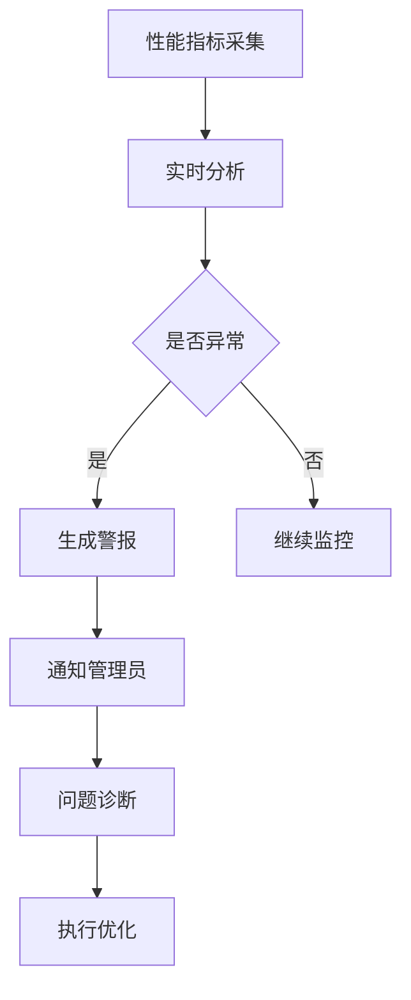

# 管理后台业务流程文档

## 目录

1. [业务概述](#业务概述)
2. [用户管理流程](#用户管理流程)
3. [内容审核流程](#内容审核流程)
4. [AI系统管理流程](#ai系统管理流程)
5. [系统监控流程](#系统监控流程)
6. [数据分析流程](#数据分析流程)
7. [权限管理体系](#权限管理体系)

## 业务概述

ResearchFounderNetwork管理后台是平台运营的核心工具，主要服务对象为平台管理员和运营人员。系统提供了全面的管理功能，包括用户管理、内容审核、AI系统配置、系统监控等。

### 核心业务目标

1. **保证平台内容质量**: 通过严格的内容审核机制
2. **维护社区健康**: 管理用户行为，处理违规内容
3. **优化系统性能**: 监控系统状态，管理AI资源
4. **数据驱动运营**: 提供全面的数据分析和导出功能

### 管理员角色定义

- **普通管理员(admin)**: 日常运营管理权限
- **超级管理员(superadmin)**: 系统配置和高级管理权限

## 用户管理流程

### 1. 新用户审核流程



**审核要点**:
- 验证用户身份真实性
- 检查研究领域和项目方向
- 评估创业经验和技能匹配度
- 审核用户提交的验证材料

### 2. 用户行为管理流程



**处理原则**:
- 轻微违规: 警告处理
- 严重违规: 暂停账号
- 恶意行为: 永久封禁

### 3. 用户数据管理

- **查看权限**: 管理员可查看用户详细信息、活动记录、匹配历史
- **编辑权限**: 仅可修改用户状态，不可修改用户个人信息
- **导出权限**: 支持批量导出用户数据用于分析

## 内容审核流程

### 1. 创始人申请审核

**审核标准**:
1. **基本信息完整性**
   - 真实姓名和联系方式
   - 研究领域描述清晰
   - 创业方向明确

2. **专业背景评估**
   - 教育背景与研究领域匹配
   - 相关工作经验
   - 技术能力证明

3. **创业潜力评估**
   - 项目可行性
   - 市场需求分析
   - 团队组建能力

### 2. 活动内容审核

**审核要点**:
- 活动主题是否符合平台定位
- 活动信息是否完整准确
- 是否存在商业推广内容
- 是否包含不当言论

### 3. AI产品审核

**审核流程**:
1. 产品信息完整性检查
2. 功能描述准确性验证
3. 定价合理性评估
4. 用户协议合规性检查

### 4. 成功案例审核

**审核标准**:
- 案例真实性验证
- 内容质量评估
- 敏感信息脱敏
- 展示价值判断

## AI系统管理流程

### 1. AI提供商管理



### 2. 路由策略管理

**可选策略**:
- **成本优化**: 优先使用成本较低的提供商
- **性能优化**: 优先使用响应速度快的提供商
- **质量优化**: 优先使用输出质量高的提供商
- **轮询均衡**: 平均分配请求到各提供商

### 3. 成本控制流程

1. **预算设置**: 设置月度预算上限
2. **实时监控**: 监控各提供商使用成本
3. **预警机制**: 接近预算时自动预警
4. **自动切换**: 超预算自动切换到备用方案

## 系统监控流程

### 1. 性能监控

**监控指标**:
- 系统响应时间
- 并发用户数
- 数据库查询性能
- API调用延迟

**处理流程**:


### 2. 错误监控

**错误分类**:
- 系统错误: 服务器异常、数据库连接失败
- 业务错误: 数据验证失败、权限不足
- 用户错误: 操作错误、输入无效

**处理优先级**:
1. **Critical**: 影响核心功能，立即处理
2. **High**: 影响用户体验，2小时内处理
3. **Medium**: 非关键功能，24小时内处理
4. **Low**: 优化建议，计划处理

### 3. 安全监控

- 异常登录检测
- API调用频率监控
- 敏感操作审计
- 数据访问记录

## 数据分析流程

### 1. 用户行为分析

**分析维度**:
- 用户增长趋势
- 活跃度分析
- 留存率统计
- 转化漏斗分析

### 2. 内容质量分析

**评估指标**:
- 内容发布量
- 用户互动率
- 内容质量评分
- 违规内容比例

### 3. 匹配效果分析

**关键指标**:
- 匹配成功率
- 用户满意度
- 合作转化率
- 匹配算法准确性

## 权限管理体系

### 1. 功能权限矩阵

| 功能模块 | 普通管理员 | 超级管理员 |
|---------|-----------|-----------|
| 查看用户信息 | ✓ | ✓ |
| 审核用户申请 | ✓ | ✓ |
| 管理用户状态 | ✓ | ✓ |
| 查看系统统计 | ✓ | ✓ |
| 内容审核 | ✓ | ✓ |
| AI系统配置 | 只读 | ✓ |
| 系统参数配置 | ✗ | ✓ |
| 数据导出 | 部分 | ✓ |
| 查看操作日志 | 自己的 | 所有 |
| 发送系统公告 | ✗ | ✓ |

### 2. 数据权限控制

**敏感数据访问规则**:
1. 用户密码: 任何管理员都不可查看
2. API密钥: 只显示后4位，超管可更新
3. 个人隐私信息: 需要操作理由记录
4. 财务数据: 仅超管可访问

### 3. 操作审计要求

**需记录的操作**:
- 用户状态变更
- 内容审核决定
- 系统配置修改
- 数据导出操作
- 批量操作执行

**审计日志内容**:
```json
{
  "operatorId": "管理员ID",
  "operatorName": "管理员姓名",
  "action": "操作类型",
  "target": "操作对象",
  "before": "操作前状态",
  "after": "操作后状态",
  "reason": "操作原因",
  "timestamp": "操作时间",
  "ip": "操作IP"
}
```

## 最佳实践建议

### 1. 日常运营建议

- **定期审核**: 每日固定时间处理待审核内容
- **快速响应**: 用户申诉24小时内响应
- **数据备份**: 每周导出关键数据备份
- **团队协作**: 使用标签和备注便于交接

### 2. 应急处理流程

1. **系统故障**: 立即切换到维护模式
2. **数据泄露**: 紧急封锁相关账号
3. **恶意攻击**: 启用防护机制
4. **舆情危机**: 快速响应和公告

### 3. 持续优化建议

- 定期分析审核效率
- 收集用户反馈改进流程
- 优化自动化审核规则
- 提升管理工具易用性