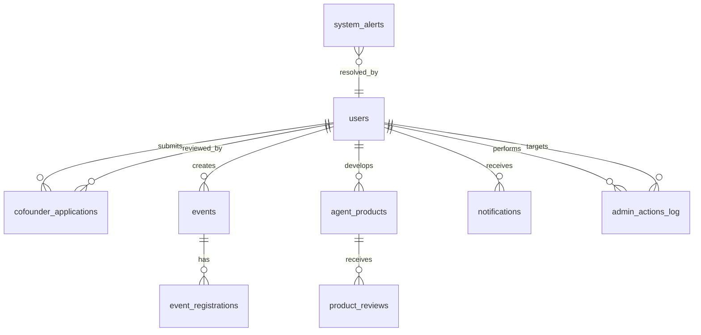

# 管理后台数据模型文档

## 数据库架构概述

ResearchFounderNetwork使用PostgreSQL作为主数据库，通过Drizzle ORM进行数据操作。数据模型设计遵循以下原则：

- **规范化设计**: 避免数据冗余
- **关系完整性**: 使用外键约束
- **性能优化**: 合理使用索引
- **扩展性**: 支持未来功能扩展

## 核心数据表

### 1. 用户表 (users)

```typescript
export const users = pgTable("users", {
  id: serial("id").primaryKey(),
  username: varchar("username", { length: 50 }).unique().notNull(),
  email: varchar("email", { length: 100 }).unique().notNull(),
  password: varchar("password", { length: 255 }).notNull(),
  fullName: varchar("full_name", { length: 100 }).notNull(),
  role: varchar("role", { length: 20 }).default("user").notNull(),
  isApproved: boolean("is_approved").default(false),
  profileImage: varchar("profile_image", { length: 255 }),
  bio: text("bio"),
  researchInterests: text("research_interests").array(),
  skills: text("skills").array(),
  linkedinProfile: varchar("linkedin_profile", { length: 255 }),
  githubProfile: varchar("github_profile", { length: 255 }),
  personalWebsite: varchar("personal_website", { length: 255 }),
  createdAt: timestamp("created_at").defaultNow().notNull(),
  updatedAt: timestamp("updated_at").defaultNow().notNull(),
  lastLoginAt: timestamp("last_login_at"),
  isActive: boolean("is_active").default(true),
  isSuspended: boolean("is_suspended").default(false),
  suspendedAt: timestamp("suspended_at"),
  suspendedReason: text("suspended_reason"),
  warningCount: integer("warning_count").default(0),
});
```

**字段说明**:
- `role`: 用户角色 (user, admin, superadmin)
- `isApproved`: 是否通过创始人认证
- `isSuspended`: 账号是否被暂停
- `warningCount`: 收到的警告次数

**索引**:
- email (唯一索引)
- username (唯一索引)
- role (普通索引)
- isApproved (普通索引)

### 2. 创始人申请表 (cofounder_applications)

```typescript
export const cofounderApplications = pgTable("cofounder_applications", {
  id: serial("id").primaryKey(),
  userId: integer("user_id").references(() => users.id).notNull(),
  
  // 基本信息
  affiliation: varchar("affiliation", { length: 200 }),
  position: varchar("position", { length: 100 }),
  yearsOfExperience: integer("years_of_experience"),
  education: text("education"),
  
  // 研究领域
  researchField: varchar("research_field", { length: 200 }).notNull(),
  researchAchievements: text("research_achievements"),
  publications: text("publications"),
  
  // 创业信息
  startupExperience: text("startup_experience"),
  entrepreneurialMotivation: text("entrepreneurial_motivation"),
  startupDirection: text("startup_direction"),
  cofounderExpectations: text("cofounder_expectations"),
  
  // 技能和资源
  technicalSkills: text("technical_skills").array(),
  businessSkills: text("business_skills").array(),
  resources: text("resources"),
  
  // 验证信息
  verificationMethod: varchar("verification_method", { length: 50 }),
  verificationDetails: text("verification_details"),
  verificationDocuments: text("verification_documents").array(),
  
  // 审核信息
  status: varchar("status", { length: 20 }).default("pending").notNull(),
  reviewedBy: integer("reviewed_by").references(() => users.id),
  reviewedAt: timestamp("reviewed_at"),
  verificationNotes: text("verification_notes"),
  
  // 匹配偏好
  preferredRoles: text("preferred_roles").array(),
  preferredIndustries: text("preferred_industries").array(),
  commitmentLevel: varchar("commitment_level", { length: 50 }),
  
  createdAt: timestamp("created_at").defaultNow().notNull(),
  updatedAt: timestamp("updated_at").defaultNow().notNull(),
});
```

**状态流转**:
- `pending`: 待审核
- `approved`: 已通过
- `rejected`: 已拒绝
- `additional_info_required`: 需补充信息

### 3. 活动表 (events)

```typescript
export const events = pgTable("events", {
  id: serial("id").primaryKey(),
  title: varchar("title", { length: 200 }).notNull(),
  description: text("description"),
  type: varchar("type", { length: 50 }).notNull(),
  category: varchar("category", { length: 50 }),
  date: timestamp("date").notNull(),
  duration: integer("duration"),
  location: varchar("location", { length: 200 }),
  isOnline: boolean("is_online").default(false),
  meetingLink: varchar("meeting_link", { length: 500 }),
  maxParticipants: integer("max_participants"),
  currentParticipants: integer("current_participants").default(0),
  tags: text("tags").array(),
  imageUrl: varchar("image_url", { length: 500 }),
  createdBy: integer("created_by").references(() => users.id).notNull(),
  status: varchar("status", { length: 20 }).default("active"),
  isFeatured: boolean("is_featured").default(false),
  viewCount: integer("view_count").default(0),
  createdAt: timestamp("created_at").defaultNow().notNull(),
  updatedAt: timestamp("updated_at").defaultNow().notNull(),
});
```

### 4. AI产品表 (agent_products)

```typescript
export const agentProducts = pgTable("agent_products", {
  id: serial("id").primaryKey(),
  name: varchar("name", { length: 200 }).notNull(),
  description: text("description").notNull(),
  category: varchar("category", { length: 100 }).notNull(),
  tags: text("tags").array(),
  features: text("features").array(),
  pricing: jsonb("pricing"),
  imageUrl: varchar("image_url", { length: 500 }),
  websiteUrl: varchar("website_url", { length: 500 }),
  apiEndpoint: varchar("api_endpoint", { length: 500 }),
  documentation: text("documentation"),
  
  creatorId: integer("creator_id").references(() => users.id).notNull(),
  status: varchar("status", { length: 20 }).default("pending"),
  isVerified: boolean("is_verified").default(false),
  
  usageCount: integer("usage_count").default(0),
  rating: numeric("rating", { precision: 3, scale: 2 }),
  reviewCount: integer("review_count").default(0),
  
  createdAt: timestamp("created_at").defaultNow().notNull(),
  updatedAt: timestamp("updated_at").defaultNow().notNull(),
});
```

## 管理相关数据表

### 5. 管理操作日志表 (admin_actions_log)

```typescript
export const adminActionsLog = pgTable("admin_actions_log", {
  id: serial("id").primaryKey(),
  adminId: integer("admin_id").references(() => users.id).notNull(),
  action: varchar("action", { length: 50 }).notNull(),
  targetType: varchar("target_type", { length: 50 }).notNull(),
  targetId: integer("target_id").notNull(),
  details: jsonb("details"),
  reason: text("reason"),
  ipAddress: varchar("ip_address", { length: 45 }),
  userAgent: text("user_agent"),
  createdAt: timestamp("created_at").defaultNow().notNull(),
});
```

**记录的操作类型**:
- 用户管理: approve_user, reject_user, suspend_user, warn_user
- 内容审核: approve_content, reject_content, delete_content
- 系统配置: update_config, update_ai_provider

### 6. 系统通知表 (notifications)

```typescript
export const notifications = pgTable("notifications", {
  id: serial("id").primaryKey(),
  userId: integer("user_id").references(() => users.id).notNull(),
  type: varchar("type", { length: 50 }).notNull(),
  title: varchar("title", { length: 200 }).notNull(),
  message: text("message").notNull(),
  data: jsonb("data"),
  priority: varchar("priority", { length: 20 }).default("medium"),
  isRead: boolean("is_read").default(false),
  readAt: timestamp("read_at"),
  createdAt: timestamp("created_at").defaultNow().notNull(),
});
```

### 7. 系统警报表 (system_alerts)

```typescript
export const systemAlerts = pgTable("system_alerts", {
  id: serial("id").primaryKey(),
  level: varchar("level", { length: 20 }).notNull(),
  title: varchar("title", { length: 200 }).notNull(),
  message: text("message").notNull(),
  component: varchar("component", { length: 100 }),
  details: jsonb("details"),
  isResolved: boolean("is_resolved").default(false),
  resolvedBy: integer("resolved_by").references(() => users.id),
  resolvedAt: timestamp("resolved_at"),
  createdAt: timestamp("created_at").defaultNow().notNull(),
});
```

## 统计相关数据表

### 8. 平台统计快照表 (platform_stats_snapshots)

```typescript
export const platformStatsSnapshots = pgTable("platform_stats_snapshots", {
  id: serial("id").primaryKey(),
  snapshotDate: date("snapshot_date").notNull(),
  
  // 用户统计
  totalUsers: integer("total_users").notNull(),
  activeUsers: integer("active_users").notNull(),
  newUsers: integer("new_users").notNull(),
  approvedUsers: integer("approved_users").notNull(),
  
  // 内容统计
  totalEvents: integer("total_events").notNull(),
  totalProducts: integer("total_products").notNull(),
  totalApplications: integer("total_applications").notNull(),
  
  // 参与度统计
  totalMatches: integer("total_matches").notNull(),
  totalMessages: integer("total_messages").notNull(),
  totalRegistrations: integer("total_registrations").notNull(),
  
  // 系统指标
  avgResponseTime: numeric("avg_response_time"),
  errorRate: numeric("error_rate"),
  
  createdAt: timestamp("created_at").defaultNow().notNull(),
});
```

### 9. AI使用统计表 (ai_usage_stats)

```typescript
export const aiUsageStats = pgTable("ai_usage_stats", {
  id: serial("id").primaryKey(),
  providerId: varchar("provider_id", { length: 50 }).notNull(),
  date: date("date").notNull(),
  requestCount: integer("request_count").default(0),
  successCount: integer("success_count").default(0),
  failureCount: integer("failure_count").default(0),
  totalCost: numeric("total_cost", { precision: 10, scale: 2 }),
  avgLatency: numeric("avg_latency"),
  createdAt: timestamp("created_at").defaultNow().notNull(),
});
```

## 数据关系图



## 索引优化策略

### 查询性能索引

```sql
-- 用户查询优化
CREATE INDEX idx_users_role_approved ON users(role, is_approved);
CREATE INDEX idx_users_created_at ON users(created_at DESC);

-- 申请查询优化
CREATE INDEX idx_applications_status ON cofounder_applications(status);
CREATE INDEX idx_applications_user_status ON cofounder_applications(user_id, status);

-- 活动查询优化
CREATE INDEX idx_events_date_status ON events(date, status);
CREATE INDEX idx_events_created_by ON events(created_by);

-- 日志查询优化
CREATE INDEX idx_admin_log_created_at ON admin_actions_log(created_at DESC);
CREATE INDEX idx_admin_log_admin_action ON admin_actions_log(admin_id, action);
```

### 统计查询优化

```sql
-- 聚合查询优化
CREATE INDEX idx_stats_snapshot_date ON platform_stats_snapshots(snapshot_date DESC);
CREATE INDEX idx_ai_usage_provider_date ON ai_usage_stats(provider_id, date);
```

## 数据安全策略

### 1. 敏感数据加密

- 用户密码: bcrypt加密存储
- API密钥: AES加密存储
- 个人隐私信息: 根据需要加密

### 2. 数据访问控制

```typescript
// 行级安全策略示例
export const userDataPolicy = {
  // 普通用户只能查看自己的数据
  user: (userId: number) => eq(users.id, userId),
  
  // 管理员可以查看所有数据
  admin: () => sql`true`,
};
```

### 3. 审计追踪

所有管理操作都记录在 `admin_actions_log` 表中，包括：
- 操作者信息
- 操作时间
- 操作对象
- 操作原因
- IP地址

## 数据维护建议

### 1. 定期清理

- 日志数据: 保留90天
- 统计快照: 保留1年
- 已删除内容: 软删除保留30天

### 2. 数据备份

- 全量备份: 每日一次
- 增量备份: 每小时一次
- 异地备份: 每周一次

### 3. 性能监控

- 慢查询监控
- 索引使用率分析
- 表空间增长监控

## 未来扩展考虑

### 1. 分表策略

当数据量增长时考虑：
- 用户表按注册时间分表
- 日志表按月份分表
- 消息表按会话分表

### 2. 缓存层设计

- Redis缓存热点数据
- 统计数据预计算
- 会话数据缓存

### 3. 数据归档

- 历史数据迁移到冷存储
- 压缩存储优化
- 数据生命周期管理