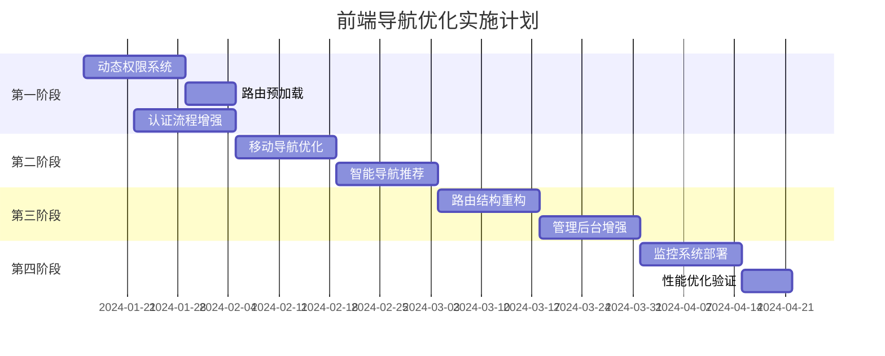

# ResearchFounderNetwork 前端导航优化计划

## 执行摘要

基于当前导航架构评估，制定分阶段优化计划，重点提升用户体验、性能和可维护性。

## 第一阶段：核心体验优化（2-3周）

### 1.1 动态权限系统实现 ⭐️ 高优先级

#### 实施步骤

1. **创建权限组件** (第1周)
```typescript
// client/src/components/auth/RoleRoute.tsx
import { Navigate } from "wouter";
import { useAuth } from "@/hooks/use-auth";

interface RoleRouteProps {
  roles: string[];
  children: React.ReactNode;
  fallback?: string;
}

export function RoleRoute({ roles, children, fallback = "/platform/403" }: RoleRouteProps) {
  const { user } = useAuth();
  
  if (!user) {
    return <Navigate to="/platform/auth" />;
  }
  
  if (!roles.some(role => user.roles?.includes(role))) {
    return <Navigate to={fallback} />;
  }
  
  return <>{children}</>;
}
```

2. **创建403错误页面** (第1周)
```typescript
// client/src/pages/forbidden-page.tsx
export default function ForbiddenPage() {
  return (
    <div className="flex flex-col items-center justify-center min-h-screen">
      <h1 className="text-4xl font-bold mb-4">403 - 权限不足</h1>
      <p className="text-gray-600 mb-8">您没有访问此页面的权限</p>
      <Link href="/platform">
        <Button>返回主页</Button>
      </Link>
    </div>
  );
}
```

3. **更新路由配置** (第2周)
```typescript
// 更新 App.tsx
<RoleRoute roles={["admin", "superadmin"]} path="/platform/admin">
  <AdvancedAdminPage />
</RoleRoute>
```

4. **扩展用户模型** (第2周)
```typescript
// shared/schema.ts
export const userRoles = z.enum([
  "user",
  "founder",
  "investor", 
  "mentor",
  "admin",
  "superadmin"
]);
```

### 1.2 路由预加载优化 ⭐️ 高优先级

#### 实施步骤

1. **创建预加载工具** (第2周)
```typescript
// client/src/lib/route-preloader.ts
const routeComponents = {
  '/platform/ai-matching': () => import('@/pages/ai-matching-page'),
  '/platform/workspace': () => import('@/pages/collaboration-workspace-page'),
  '/platform/analytics': () => import('@/pages/matching-analytics-page'),
  // ... 其他路由
};

export function preloadRoute(path: string) {
  const loader = routeComponents[path];
  if (loader && !preloadedRoutes.has(path)) {
    loader();
    preloadedRoutes.add(path);
  }
}
```

2. **增强导航组件** (第3周)
```typescript
// client/src/components/navbar.tsx
<Link 
  href={link.href}
  onMouseEnter={() => preloadRoute(link.href)}
  className={cn(
    "transition-colors hover:text-primary",
    isActive(link.href) && "text-primary font-medium"
  )}
>
  {link.label}
</Link>
```

3. **性能监控** (第3周)
```typescript
// client/src/lib/performance-monitor.ts
export function trackRouteChange(from: string, to: string) {
  const startTime = performance.now();
  
  return {
    complete: () => {
      const duration = performance.now() - startTime;
      analytics.track('route_change', {
        from,
        to,
        duration,
        timestamp: new Date().toISOString()
      });
    }
  };
}
```

### 1.3 认证流程增强

#### 实施步骤

1. **保存原始访问意图** (第2周)
```typescript
// client/src/lib/protected-route.tsx
export function ProtectedRoute({ component: Component, ...rest }: ProtectedRouteProps) {
  const { user, isLoading } = useAuth();
  const [location] = useLocation();
  
  if (!user && !isLoading) {
    // 保存原始URL
    sessionStorage.setItem('redirect_after_login', location);
    return <Redirect to="/platform/auth" />;
  }
  
  return <Component {...rest} />;
}
```

2. **更新认证成功处理** (第3周)
```typescript
// client/src/pages/auth-page.tsx
const handleAuthSuccess = (user: User) => {
  const redirectUrl = sessionStorage.getItem('redirect_after_login') || '/platform';
  sessionStorage.removeItem('redirect_after_login');
  setLocation(redirectUrl);
};
```

## 第二阶段：移动体验与智能化（3-4周）

### 2.1 移动导航深度优化

#### 实施计划

1. **分组导航结构** (第4周)
```typescript
// client/src/components/mobile-nav.tsx
const navGroups = [
  {
    title: "匹配功能",
    items: [
      { label: "创始人匹配", href: "/platform/matching", icon: Users },
      { label: "AI智能匹配", href: "/platform/ai-matching", icon: Brain },
      { label: "滑动匹配", href: "/platform/swipe-matching", icon: Heart }
    ]
  },
  {
    title: "内容与活动",
    items: [
      { label: "活动中心", href: "/platform/events", icon: Calendar },
      { label: "内容社区", href: "/platform/community", icon: MessageSquare }
    ]
  }
  // ... 其他分组
];
```

2. **手势支持** (第5周)
```typescript
// client/src/hooks/use-swipe.ts
export function useSwipeNavigation() {
  const [, setLocation] = useLocation();
  const history = useNavigationHistory();
  
  useSwipeGesture({
    onSwipeRight: () => {
      if (history.canGoBack) {
        setLocation(history.previousPath);
      }
    }
  });
}
```

### 2.2 智能导航推荐

#### 实施计划

1. **用户行为追踪** (第5周)
```typescript
// client/src/services/navigation-analytics.ts
export class NavigationAnalytics {
  private visitCounts: Map<string, number> = new Map();
  
  trackVisit(path: string) {
    const count = this.visitCounts.get(path) || 0;
    this.visitCounts.set(path, count + 1);
    this.saveToLocalStorage();
  }
  
  getTopRoutes(limit: number = 5): string[] {
    return Array.from(this.visitCounts.entries())
      .sort(([,a], [,b]) => b - a)
      .slice(0, limit)
      .map(([path]) => path);
  }
}
```

2. **个性化导航菜单** (第6周)
```typescript
// client/src/hooks/use-personalized-nav.ts
export function usePersonalizedNav() {
  const { user } = useAuth();
  const analytics = useNavigationAnalytics();
  
  return useMemo(() => {
    const baseNav = [...defaultNavItems];
    
    // 根据用户角色添加特定项
    if (user?.roles?.includes('investor')) {
      baseNav.splice(2, 0, {
        label: "项目库",
        href: "/platform/startups",
        icon: Briefcase
      });
    }
    
    // 根据访问频率排序
    const topRoutes = analytics.getTopRoutes();
    return baseNav.sort((a, b) => {
      const aIndex = topRoutes.indexOf(a.href);
      const bIndex = topRoutes.indexOf(b.href);
      if (aIndex === -1) return 1;
      if (bIndex === -1) return -1;
      return aIndex - bIndex;
    });
  }, [user, analytics]);
}
```

## 第三阶段：架构升级与高级特性（4-6周）

### 3.1 路由结构重构

#### 迁移计划

1. **新路由映射** (第7-8周)
```typescript
// client/src/lib/route-migration.ts
const routeMigrationMap = {
  '/': '/landing',
  '/platform': '/platform/dashboard',
  '/platform/tinder-matching': '/platform/swipe-matching'
};

export function migrateRoute(oldPath: string): string {
  return routeMigrationMap[oldPath] || oldPath;
}
```

2. **兼容性中间件** (第8周)
```typescript
// server/middleware/route-compatibility.ts
export function routeCompatibility(req: Request, res: Response, next: NextFunction) {
  const migrated = migrateRoute(req.path);
  if (migrated !== req.path) {
    return res.redirect(301, migrated);
  }
  next();
}
```

### 3.2 管理后台增强

#### 实施计划

1. **URL同步标签状态** (第9周)
```typescript
// client/src/pages/advanced-admin-page.tsx
export function AdvancedAdminPage() {
  const [location, setLocation] = useLocation();
  const searchParams = new URLSearchParams(location.split('?')[1]);
  const [activeTab, setActiveTab] = useState(searchParams.get('tab') || 'dashboard');
  
  const handleTabChange = (tab: string) => {
    setActiveTab(tab);
    setLocation(`/platform/admin?tab=${tab}`);
  };
  
  // ... 渲染逻辑
}
```

2. **全局命令菜单** (第10周)
```typescript
// client/src/components/command-menu.tsx
export function CommandMenu() {
  const [open, setOpen] = useState(false);
  
  useEffect(() => {
    const down = (e: KeyboardEvent) => {
      if (e.key === 'k' && (e.metaKey || e.ctrlKey)) {
        e.preventDefault();
        setOpen(open => !open);
      }
    };
    
    document.addEventListener('keydown', down);
    return () => document.removeEventListener('keydown', down);
  }, []);
  
  return (
    <CommandDialog open={open} onOpenChange={setOpen}>
      <CommandInput placeholder="搜索功能..." />
      <CommandList>
        <CommandGroup heading="导航">
          <CommandItem onSelect={() => navigate('/platform/users')}>
            用户管理
          </CommandItem>
          {/* ... 其他命令 */}
        </CommandGroup>
      </CommandList>
    </CommandDialog>
  );
}
```

## 第四阶段：性能与监控（2-3周）

### 4.1 错误监控系统

```typescript
// client/src/lib/error-monitoring.ts
window.addEventListener('unhandledrejection', (event) => {
  if (event.reason?.message?.includes('navigation')) {
    logError({
      type: 'navigation_error',
      path: window.location.pathname,
      error: event.reason,
      timestamp: new Date().toISOString()
    });
  }
});
```

### 4.2 性能指标收集

```typescript
// client/src/lib/performance-metrics.ts
export function collectNavigationMetrics() {
  const observer = new PerformanceObserver((list) => {
    list.getEntries().forEach((entry) => {
      if (entry.entryType === 'navigation') {
        analytics.track('page_load_performance', {
          path: window.location.pathname,
          dns: entry.domainLookupEnd - entry.domainLookupStart,
          tcp: entry.connectEnd - entry.connectStart,
          request: entry.responseStart - entry.requestStart,
          response: entry.responseEnd - entry.responseStart,
          dom: entry.domComplete - entry.domInteractive,
          load: entry.loadEventEnd - entry.loadEventStart,
          total: entry.loadEventEnd - entry.fetchStart
        });
      }
    });
  });
  
  observer.observe({ entryTypes: ['navigation'] });
}
```

## 实施时间线



## 成功指标

| 指标 | 当前值 | 目标值 | 测量方法 |
|------|--------|--------|----------|
| 页面加载时间 | 2.5s | < 1s | Performance API |
| 路由切换延迟 | 800ms | < 300ms | 自定义计时器 |
| 移动端跳出率 | 45% | < 25% | Google Analytics |
| 权限错误率 | 12% | < 2% | 错误日志分析 |
| 用户满意度 | 7.2/10 | > 8.5/10 | NPS调查 |

## 风险控制

1. **A/B测试策略**
   - 10%用户灰度发布新导航
   - 监控关键指标2周
   - 问题快速回滚机制

2. **兼容性保证**
   - 旧路由301重定向
   - 保留6个月过渡期
   - 详细迁移文档

3. **性能降级方案**
   - 预加载失败时降级为按需加载
   - 权限系统异常时默认允许访问
   - 客户端缓存异常时使用服务端数据

---

*文档创建日期: 2024-08-18*
*最后更新: 2024-08-18*
*负责人: 开发团队*