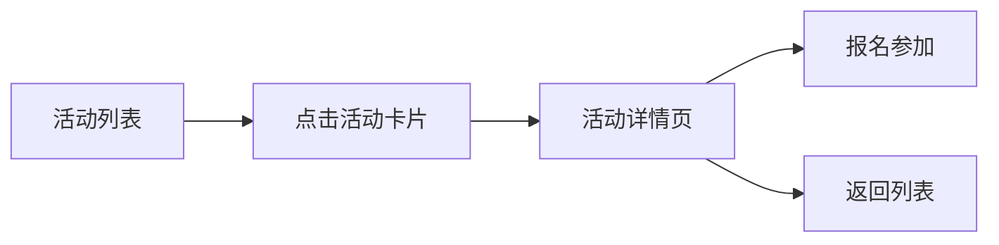
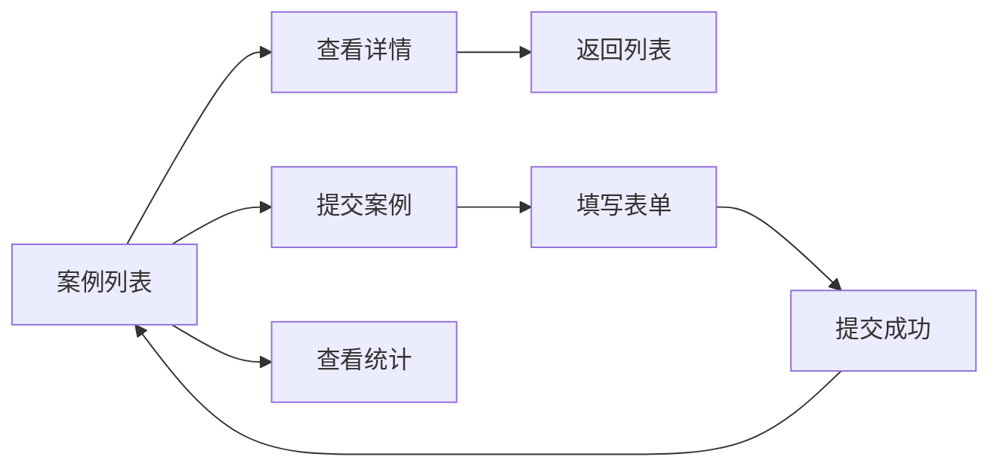

# ResearchFounderNetwork 前端导航架构文档

## 概述

本文档详细说明了 ResearchFounderNetwork（潜空间）平台的前端导航结构、路由配置、页面跳转逻辑和用户流程。

## 1. 路由架构

### 1.1 路由层级结构

```
/ (根路径)
├── 动画着陆页 (landing.html) - 由Express服务器提供
└── /platform (React应用根路径)
    ├── / (主页)
    ├── /auth (认证页面)
    ├── /events (活动中心)
    │   └── /:id (活动详情)
    ├── /community (内容社区)
    ├── /matching (创始人匹配)
    ├── /ai-matching (AI智能匹配)
    ├── /tinder-matching (滑动卡片匹配)
    ├── /search (智能搜索)
    ├── /workspace (协作空间)
    ├── /marketplace (AI工具市场)
    ├── /reputation (信誉系统)
    ├── /success-stories (成功案例)
    │   ├── /:id (案例详情)
    │   ├── /submit (提交案例)
    │   └── /metrics (数据统计)
    ├── /profile (用户资料)
    ├── /messages (消息中心)
    ├── /analytics (分析洞察)
    ├── /discovery (内容发现)
    └── /admin (管理后台)
        ├── /interviews (面试评估)
        ├── /ab-testing (A/B测试)
        └── /success-stories (案例管理)
```

### 1.2 公开路由 vs 保护路由

#### 公开路由（无需登录）
- `/` - 重定向到动画着陆页
- `/platform` - 主页
- `/platform/auth` - 登录/注册页面
- `/platform/success-stories` - 成功案例列表
- `/platform/success-stories/:id` - 案例详情
- `/platform/success-stories/metrics` - 成功案例统计

#### 保护路由（需要登录）
- 所有其他 `/platform/*` 路径
- 未登录用户访问保护路由会被重定向到 `/platform/auth`

## 2. 导航组件

### 2.1 主导航栏 (Navbar)

导航栏根据用户状态显示不同内容：

#### 已登录用户导航项
```javascript
活动中心 → /platform/events
智能搜索 → /platform/search
内容社区 → /platform/community
创始人匹配 → /platform/matching
AI智能匹配 → /platform/ai-matching
智能匹配卡片 → /platform/tinder-matching
成功案例 → /platform/success-stories
协作空间 → /platform/workspace
AI工具市场 → /platform/marketplace
信誉系统 → /platform/reputation
内容发现 → /platform/discovery
分析洞察 → /platform/analytics
消息 → /platform/messages
```

#### 管理员特有导航
- 管理后台按钮 → `/platform/admin`
- 面试评估 → `/platform/admin/interviews`
- A/B测试 → `/platform/admin/ab-testing`

#### 用户菜单（下拉）
- 个人资料 → `/platform/profile`
- 退出登录（清除认证状态）

#### 未登录用户
- 登录按钮 → `/platform/auth`
- 注册按钮 → `/platform/auth`

### 2.2 移动端导航

- 汉堡菜单触发抽屉式导航
- 包含与桌面端相同的导航链接
- 响应式设计，自动适配

## 3. 页面跳转流程

### 3.1 认证流程


### 3.2 活动浏览流程



### 3.3 成功案例流程



### 3.4 主页导航分支

主页提供多个入口点：
- 未登录用户 → 引导至 `/platform/auth`
- 已登录用户 → 分别进入各功能模块

## 4. 特殊导航逻辑

### 4.1 根路径处理

- Vite开发服务器 (5173端口) 访问 `/` → 重定向到 Express服务器的动画页面
- Express服务器 (5001端口) 访问 `/` → 显示 `landing.html` 动画页面
- 动画页面点击"进入" → 跳转到 `/platform`

### 4.2 条件导航

#### 基于认证状态
```javascript
{user ? (
  <Link href="/platform/matching">开始匹配</Link>
) : (
  <Link href="/platform/auth">立即注册</Link>
)}
```

#### 基于用户角色
```javascript
{user?.role === "admin" && (
  <Button onClick={() => setLocation("/platform/admin")}>
    管理后台
  </Button>
)}
```

### 4.3 程序化导航

```javascript
// 使用 wouter 的 useLocation
const [location, setLocation] = useLocation();
setLocation("/platform/success-stories");

// 外部跳转
window.location.href = 'http://localhost:5001/';

// 页面刷新
window.location.reload();
```

## 5. 管理后台导航

管理后台使用标签页导航：

```
总览 → 仪表板统计
用户管理 → 用户列表和操作
内容审核 → 待审核内容
成功案例 → 案例管理
面试评估 → 面试记录
AI管理 → AI服务配置
系统监控 → 性能指标
通知管理 → 通知配置
数据分析 → 平台数据
```

## 6. 导航状态管理

### 6.1 活动路由高亮

导航栏使用当前路径匹配来高亮活动链接：
```javascript
const isActive = (path: string) => location === path;
className={isActive(link.href) ? "text-primary" : "text-gray-600"}
```

### 6.2 404错误处理

- 所有未匹配路由显示 `NotFound` 组件
- 提供返回主页的链接

### 6.3 错误边界

- 全局错误边界捕获渲染错误
- 提供"返回主页"按钮 → `/platform`

## 7. 开发注意事项

### 7.1 路由命名规范

- 所有应用路由以 `/platform` 为前缀
- 使用小写字母和连字符
- RESTful风格：`/platform/resource/:id`

### 7.2 导航组件使用

```javascript
// 声明式导航
import { Link } from "wouter";
<Link href="/platform/events">活动中心</Link>

// 程序化导航
import { useLocation } from "wouter";
const [location, setLocation] = useLocation();
setLocation("/platform/profile");
```

### 7.3 保护路由实现

```javascript
<ProtectedRoute path="/platform/workspace" component={CollaborationWorkspacePage} />
```

## 8. 部署配置

### 8.1 开发环境

- Vite服务器: `http://localhost:5173`
- Express服务器: `http://localhost:5001`
- API代理配置在 `vite.config.ts`

### 8.2 生产环境

- 所有路由通过同一服务器提供
- 需要配置服务器端路由以支持客户端路由
- 确保 `/platform/*` 路径返回 React 应用

## 9. 未来优化建议

1. **面包屑导航** - 为深层页面提供路径导航
2. **路由过渡动画** - 提升页面切换体验
3. **路由预加载** - 提前加载可能访问的页面
4. **深链接支持** - 支持标签页的深度链接
5. **导航历史管理** - 更好的前进/后退支持

---

*文档更新日期: 2024-08-18*
*作者: Claude Code Assistant*