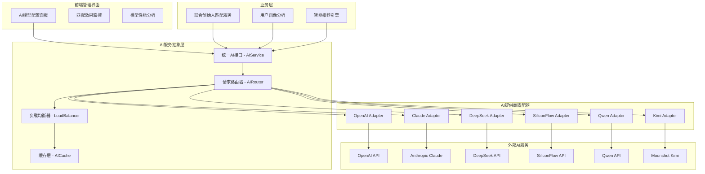

# AI集成架构设计 - 联合创始人匹配系统

## 📋 架构概览

### 核心定位
基于多AI提供商的统一接口架构，为联合创始人匹配系统提供智能分析、语义匹配和推荐算法支持，实现AI服务的无缝切换和高可用性。

### 技术架构图


## 🔧 核心组件设计

### 1. 统一AI服务接口 (AIService)

#### 1.1 核心接口规范
```typescript
interface AIService {
  // 文本嵌入生成
  generateEmbedding(text: string, options?: EmbeddingOptions): Promise<number[]>;
  
  // 语义相似度计算
  calculateSimilarity(embedding1: number[], embedding2: number[]): number;
  
  // 智能匹配分析
  analyzeCompatibility(profile1: UserProfile, profile2: UserProfile): Promise<CompatibilityScore>;
  
  // 用户画像增强
  enhanceUserProfile(profile: UserProfile): Promise<EnhancedProfile>;
  
  // 智能推荐生成
  generateRecommendations(userId: string, preferences: MatchPreferences): Promise<Recommendation[]>;
  
  // 匹配理由生成
  generateMatchReason(match: MatchResult): Promise<string>;
}
```

#### 1.2 数据模型定义
```typescript
// 用户画像模型
interface UserProfile {
  id: string;
  basicInfo: {
    name: string;
    background: string;
    skills: string[];
    experience: string[];
  };
  entrepreneurialInfo: {
    role: 'CEO' | 'CTO' | 'CPO' | 'Other';
    stage: 'idea' | 'prototype' | 'mvp' | 'scaling';
    industry: string[];
    timeCommitment: 'fulltime' | 'parttime' | 'weekend';
    location: string;
    remoteWillingness: boolean;
  };
  preferences: {
    partnerRole: string[];
    workStyle: string[];
    values: string[];
  };
}

// 增强用户画像
interface EnhancedProfile extends UserProfile {
  aiInsights: {
    personalityTraits: string[];
    workStyleAnalysis: string;
    strengthsWeaknesses: {
      strengths: string[];
      gaps: string[];
    };
    idealPartnerProfile: string;
  };
  embeddingVector: number[];
}

// 兼容性评分
interface CompatibilityScore {
  overallScore: number; // 0-100
  dimensions: {
    roleCompatibility: number;
    skillComplementarity: number;
    valueAlignment: number;
    workStyleMatch: number;
    goalAlignment: number;
  };
  reasoning: string;
  recommendedActions: string[];
}

// 匹配推荐
interface Recommendation {
  candidateId: string;
  compatibilityScore: CompatibilityScore;
  matchReason: string;
  confidence: number;
  recommendationRank: number;
}
```

### 2. AI提供商适配器架构

#### 2.1 适配器基类
```typescript
abstract class AIProviderAdapter {
  protected apiKey: string;
  protected baseUrl: string;
  protected rateLimiter: RateLimiter;
  
  constructor(config: ProviderConfig) {
    this.apiKey = config.apiKey;
    this.baseUrl = config.baseUrl;
    this.rateLimiter = new RateLimiter(config.rateLimit);
  }
  
  // 抽象方法 - 各提供商实现
  abstract generateEmbedding(text: string): Promise<number[]>;
  abstract generateCompletion(prompt: string, options: CompletionOptions): Promise<string>;
  abstract checkHealth(): Promise<boolean>;
  
  // 通用方法
  protected async makeRequest(endpoint: string, data: any): Promise<any> {
    await this.rateLimiter.wait();
    // 统一的请求处理逻辑
  }
}
```

#### 2.2 具体提供商适配器

##### OpenAI适配器
```typescript
class OpenAIAdapter extends AIProviderAdapter {
  async generateEmbedding(text: string): Promise<number[]> {
    const response = await this.makeRequest('/v1/embeddings', {
      model: 'text-embedding-3-large',
      input: text,
    });
    return response.data[0].embedding;
  }
  
  async generateCompletion(prompt: string, options: CompletionOptions): Promise<string> {
    const response = await this.makeRequest('/v1/chat/completions', {
      model: options.model || 'gpt-4o',
      messages: [{ role: 'user', content: prompt }],
      temperature: options.temperature || 0.7,
      max_tokens: options.maxTokens || 1000,
    });
    return response.choices[0].message.content;
  }
}
```

##### Claude适配器
```typescript
class ClaudeAdapter extends AIProviderAdapter {
  async generateEmbedding(text: string): Promise<number[]> {
    // Claude没有原生embedding，使用文本分析转换或调用其他embedding服务
    const analysisResult = await this.generateCompletion(
      `请分析以下文本的关键特征，返回结构化的特征向量描述：\n${text}`,
      { model: 'claude-3-5-sonnet-20241022' }
    );
    // 转换为数值向量（可配合其他embedding服务）
    return this.textToVector(analysisResult);
  }
  
  async generateCompletion(prompt: string, options: CompletionOptions): Promise<string> {
    const response = await this.makeRequest('/v1/messages', {
      model: options.model || 'claude-3-5-sonnet-20241022',
      messages: [{ role: 'user', content: prompt }],
      temperature: options.temperature || 0.7,
      max_tokens: options.maxTokens || 1000,
    });
    return response.content[0].text;
  }
}
```

##### DeepSeek适配器
```typescript
class DeepSeekAdapter extends AIProviderAdapter {
  async generateEmbedding(text: string): Promise<number[]> {
    const response = await this.makeRequest('/v1/embeddings', {
      model: 'deepseek-embedding',
      input: text,
    });
    return response.data[0].embedding;
  }
  
  async generateCompletion(prompt: string, options: CompletionOptions): Promise<string> {
    const response = await this.makeRequest('/v1/chat/completions', {
      model: options.model || 'deepseek-chat',
      messages: [{ role: 'user', content: prompt }],
      temperature: options.temperature || 0.7,
      max_tokens: options.maxTokens || 1000,
    });
    return response.choices[0].message.content;
  }
}
```

### 3. AI路由器与负载均衡

#### 3.1 智能路由策略
```typescript
class AIRouter {
  private providers: Map<string, AIProviderAdapter> = new Map();
  private loadBalancer: LoadBalancer;
  private healthChecker: HealthChecker;
  
  constructor(config: RouterConfig) {
    this.loadBalancer = new LoadBalancer(config.balanceStrategy);
    this.healthChecker = new HealthChecker(config.healthCheckInterval);
  }
  
  // 路由策略
  async route(request: AIRequest): Promise<AIProviderAdapter> {
    const availableProviders = await this.getHealthyProviders();
    
    switch (request.routingStrategy) {
      case 'cost-optimized':
        return this.getCostOptimizedProvider(availableProviders, request);
      case 'performance-optimized':
        return this.getPerformanceOptimizedProvider(availableProviders, request);
      case 'quality-optimized':
        return this.getQualityOptimizedProvider(availableProviders, request);
      case 'specific-provider':
        return this.getSpecificProvider(request.preferredProvider);
      default:
        return this.loadBalancer.getNextProvider(availableProviders);
    }
  }
  
  private getCostOptimizedProvider(providers: AIProviderAdapter[], request: AIRequest): AIProviderAdapter {
    // 成本优化路由逻辑
    const costRanking = {
      'deepseek': 1,    // 最便宜
      'qwen': 2,
      'kimi': 3,
      'siliconflow': 4,
      'openai': 5,
      'claude': 6       // 最贵
    };
    
    return providers.sort((a, b) => 
      costRanking[a.name] - costRanking[b.name]
    )[0];
  }
  
  private getQualityOptimizedProvider(providers: AIProviderAdapter[], request: AIRequest): AIProviderAdapter {
    // 质量优化路由逻辑
    const qualityRanking = {
      'claude': 1,      // 质量最高
      'openai': 2,
      'deepseek': 3,
      'qwen': 4,
      'kimi': 5,
      'siliconflow': 6
    };
    
    return providers.sort((a, b) => 
      qualityRanking[a.name] - qualityRanking[b.name]
    )[0];
  }
}
```

#### 3.2 故障恢复与降级策略
```typescript
class FallbackHandler {
  async handleProviderFailure(
    failedProvider: string, 
    request: AIRequest
  ): Promise<any> {
    // 定义降级策略
    const fallbackChain = this.getFallbackChain(failedProvider);
    
    for (const fallbackProvider of fallbackChain) {
      try {
        const provider = this.getProvider(fallbackProvider);
        if (await provider.checkHealth()) {
          return await this.executeRequest(provider, request);
        }
      } catch (error) {
        console.warn(`Fallback provider ${fallbackProvider} also failed:`, error);
        continue;
      }
    }
    
    // 所有提供商都失败，返回缓存结果或默认结果
    return this.getDefaultResponse(request);
  }
  
  private getFallbackChain(primaryProvider: string): string[] {
    const fallbackMap = {
      'openai': ['claude', 'deepseek', 'qwen'],
      'claude': ['openai', 'deepseek', 'kimi'],
      'deepseek': ['qwen', 'kimi', 'siliconflow'],
      'qwen': ['deepseek', 'kimi', 'siliconflow'],
      'kimi': ['qwen', 'deepseek', 'siliconflow'],
      'siliconflow': ['deepseek', 'qwen', 'kimi']
    };
    
    return fallbackMap[primaryProvider] || [];
  }
}
```

### 4. 缓存与性能优化

#### 4.1 多级缓存架构
```typescript
class AICache {
  private memoryCache: LRUCache;
  private redisCache: RedisClient;
  private persistentCache: DatabaseCache;
  
  async get(key: string): Promise<any> {
    // L1: 内存缓存 (最快)
    let result = this.memoryCache.get(key);
    if (result) return result;
    
    // L2: Redis缓存 (快)
    result = await this.redisCache.get(key);
    if (result) {
      this.memoryCache.set(key, result);
      return result;
    }
    
    // L3: 数据库缓存 (慢但持久)
    result = await this.persistentCache.get(key);
    if (result) {
      this.redisCache.setex(key, 3600, result); // 1小时
      this.memoryCache.set(key, result);
      return result;
    }
    
    return null;
  }
  
  async set(key: string, value: any, ttl?: number): Promise<void> {
    this.memoryCache.set(key, value);
    await this.redisCache.setex(key, ttl || 3600, value);
    await this.persistentCache.set(key, value, ttl);
  }
}
```

#### 4.2 智能缓存策略
```typescript
class SmartCacheStrategy {
  // 嵌入向量缓存 - 长期缓存（用户资料变化不频繁）
  getCacheKeyForEmbedding(text: string): string {
    return `embedding:${crypto.createHash('sha256').update(text).digest('hex')}`;
  }
  
  // 匹配结果缓存 - 短期缓存（考虑实时性）
  getCacheKeyForMatch(profile1: string, profile2: string): string {
    const sortedIds = [profile1, profile2].sort();
    return `match:${sortedIds.join(':')}:${Date.now().toString(36)}`;
  }
  
  // 推荐结果缓存 - 中期缓存（平衡实时性和性能）
  getCacheKeyForRecommendation(userId: string, preferences: string): string {
    const prefHash = crypto.createHash('md5').update(preferences).digest('hex');
    return `recommendation:${userId}:${prefHash}`;
  }
  
  getTTL(cacheType: 'embedding' | 'match' | 'recommendation'): number {
    const ttlMap = {
      'embedding': 7 * 24 * 3600,      // 7天
      'match': 1 * 3600,               // 1小时
      'recommendation': 6 * 3600       // 6小时
    };
    return ttlMap[cacheType];
  }
}
```

## 🎛️ 管理界面设计

### 1. AI模型配置面板

#### 1.1 提供商管理
```typescript
interface ProviderConfig {
  id: string;
  name: string;
  displayName: string;
  apiKey: string;
  baseUrl: string;
  isEnabled: boolean;
  priority: number;
  rateLimit: {
    requestsPerMinute: number;
    requestsPerDay: number;
  };
  pricing: {
    embeddingCostPer1K: number;
    completionCostPer1K: number;
    currency: 'USD' | 'CNY';
  };
  capabilities: {
    supportsEmbedding: boolean;
    supportsCompletion: boolean;
    maxInputLength: number;
    embeddingDimensions: number;
  };
}

// 管理界面API
class AIProviderManagementAPI {
  // 获取所有提供商配置
  async getAllProviders(): Promise<ProviderConfig[]> {
    return await this.db.providers.findAll();
  }
  
  // 更新提供商配置
  async updateProvider(id: string, config: Partial<ProviderConfig>): Promise<void> {
    await this.db.providers.update(id, config);
    await this.notifyConfigChange(id);
  }
  
  // 测试提供商连接
  async testProvider(id: string): Promise<{success: boolean, error?: string}> {
    try {
      const provider = await this.getProvider(id);
      await provider.checkHealth();
      return {success: true};
    } catch (error) {
      return {success: false, error: error.message};
    }
  }
  
  // 获取提供商使用统计
  async getProviderStats(id: string, timeRange: TimeRange): Promise<ProviderStats> {
    return await this.analytics.getProviderUsage(id, timeRange);
  }
}
```

#### 1.2 路由策略配置
```typescript
interface RoutingConfig {
  defaultStrategy: 'round-robin' | 'cost-optimized' | 'performance-optimized' | 'quality-optimized';
  strategies: {
    [key: string]: {
      providerWeights: {[providerId: string]: number};
      fallbackChain: string[];
      healthCheckEnabled: boolean;
      cacheEnabled: boolean;
    };
  };
  circuitBreaker: {
    failureThreshold: number;
    resetTimeout: number;
  };
}

// 路由配置管理
class RoutingConfigManager {
  async updateRoutingStrategy(strategy: string, config: any): Promise<void> {
    await this.validateConfig(config);
    await this.db.routingConfig.upsert(strategy, config);
    await this.reloadRouterConfig();
  }
  
  async getRoutingMetrics(): Promise<RoutingMetrics> {
    return {
      totalRequests: await this.metrics.getTotalRequests(),
      requestsByProvider: await this.metrics.getRequestsByProvider(),
      averageLatency: await this.metrics.getAverageLatency(),
      errorRates: await this.metrics.getErrorRates(),
      costBreakdown: await this.metrics.getCostBreakdown()
    };
  }
}
```

### 2. 性能监控仪表板

#### 2.1 实时监控指标
```typescript
interface PerformanceMetrics {
  realtime: {
    activeConnections: number;
    requestsPerSecond: number;
    averageResponseTime: number;
    errorRate: number;
    cacheHitRate: number;
  };
  providers: {
    [providerId: string]: {
      status: 'healthy' | 'degraded' | 'down';
      responseTime: number;
      errorRate: number;
      requestCount: number;
      costAccumulated: number;
    };
  };
  costs: {
    totalDailyCost: number;
    costByProvider: {[providerId: string]: number};
    projectedMonthlyCost: number;
  };
}

// 监控数据收集
class MetricsCollector {
  private metricsBuffer: MetricsData[] = [];
  
  async recordRequest(providerId: string, requestType: string, duration: number, success: boolean): Promise<void> {
    const metric: MetricsData = {
      timestamp: Date.now(),
      providerId,
      requestType,
      duration,
      success,
      cost: this.calculateCost(providerId, requestType)
    };
    
    this.metricsBuffer.push(metric);
    
    // 批量写入数据库
    if (this.metricsBuffer.length >= 100) {
      await this.flushMetrics();
    }
  }
  
  async flushMetrics(): Promise<void> {
    await this.db.metrics.batchInsert(this.metricsBuffer);
    this.metricsBuffer = [];
  }
}
```

#### 2.2 告警系统
```typescript
class AlertingSystem {
  private rules: AlertRule[] = [];
  
  async checkAlerts(): Promise<void> {
    const metrics = await this.getLatestMetrics();
    
    for (const rule of this.rules) {
      const shouldAlert = await this.evaluateRule(rule, metrics);
      if (shouldAlert) {
        await this.sendAlert(rule, metrics);
      }
    }
  }
  
  // 预定义告警规则
  getDefaultAlertRules(): AlertRule[] {
    return [
      {
        name: 'High Error Rate',
        condition: 'errorRate > 0.05', // 错误率超过5%
        severity: 'critical',
        notification: ['email', 'slack']
      },
      {
        name: 'High Response Time',
        condition: 'averageResponseTime > 5000', // 响应时间超过5秒
        severity: 'warning',
        notification: ['email']
      },
      {
        name: 'Daily Cost Exceeded',
        condition: 'dailyCost > 1000', // 日成本超过1000元
        severity: 'warning',
        notification: ['email', 'slack']
      },
      {
        name: 'Provider Down',
        condition: 'providerStatus == "down"',
        severity: 'critical',
        notification: ['email', 'slack', 'sms']
      }
    ];
  }
}
```

### 3. A/B测试与效果评估

#### 3.1 A/B测试框架
```typescript
class AIModelABTestFramework {
  async createExperiment(config: ExperimentConfig): Promise<string> {
    const experiment: Experiment = {
      id: generateId(),
      name: config.name,
      description: config.description,
      variants: config.variants,
      trafficSplit: config.trafficSplit,
      metrics: config.metrics,
      startTime: new Date(),
      endTime: config.endTime,
      status: 'running'
    };
    
    await this.db.experiments.create(experiment);
    return experiment.id;
  }
  
  async assignVariant(userId: string, experimentId: string): Promise<string> {
    const experiment = await this.db.experiments.findById(experimentId);
    const userHash = this.hashUserId(userId, experimentId);
    
    // 基于用户哈希分配变体，确保一致性
    let cumulative = 0;
    for (const [variant, percentage] of Object.entries(experiment.trafficSplit)) {
      cumulative += percentage;
      if (userHash < cumulative) {
        await this.recordAssignment(userId, experimentId, variant);
        return variant;
      }
    }
    
    return experiment.variants[0]; // 默认变体
  }
  
  async recordMetric(userId: string, experimentId: string, metric: string, value: number): Promise<void> {
    await this.db.experimentMetrics.create({
      userId,
      experimentId,
      metric,
      value,
      timestamp: new Date()
    });
  }
  
  async getExperimentResults(experimentId: string): Promise<ExperimentResults> {
    const metrics = await this.db.experimentMetrics.findByExperimentId(experimentId);
    return this.analyzeResults(metrics);
  }
}

// A/B测试配置示例
const matchingQualityTest: ExperimentConfig = {
  name: "AI Provider Matching Quality Test",
  description: "测试不同AI提供商在联合创始人匹配质量上的差异",
  variants: ["openai", "claude", "deepseek"],
  trafficSplit: {
    "openai": 0.4,
    "claude": 0.3,
    "deepseek": 0.3
  },
  metrics: [
    "match_satisfaction_score",
    "successful_connections",
    "conversation_duration",
    "follow_up_meetings"
  ],
  duration: 30 // 30天
};
```

## 🔧 实施计划

### Phase 1: 核心架构搭建 (2周)
- [x] 统一AI接口设计
- [x] 基础适配器架构
- [x] OpenAI和Claude适配器实现
- [ ] 路由器和负载均衡器
- [ ] 基础缓存系统

### Phase 2: 提供商扩展 (2周)
- [ ] DeepSeek适配器
- [ ] Qwen适配器
- [ ] Kimi适配器
- [ ] SiliconFlow适配器
- [ ] 健康检查和故障恢复

### Phase 3: 管理界面 (3周)
- [ ] 提供商配置面板
- [ ] 路由策略管理
- [ ] 性能监控仪表板
- [ ] 告警系统集成

### Phase 4: 优化与测试 (2周)
- [ ] A/B测试框架
- [ ] 性能优化
- [ ] 智能缓存策略
- [ ] 成本优化算法

### Phase 5: 生产部署 (1周)
- [ ] 生产环境配置
- [ ] 监控告警部署
- [ ] 文档完善
- [ ] 培训和移交

## 📊 成功指标

| 指标类别 | 具体指标 | 目标值 |
|---------|---------|-------|
| 性能指标 | 平均响应时间 | <2秒 |
| 可用性 | 系统可用率 | >99.9% |
| 成本控制 | 月度AI成本 | <¥10,000 |
| 质量指标 | 匹配成功率提升 | +20% |
| 用户体验 | 匹配满意度 | >4.5/5 |

## 🔐 安全与合规

### 数据安全
- 所有AI请求数据加密传输
- 敏感用户信息脱敏处理
- API密钥安全存储和轮换
- 访问日志记录和审计

### 合规要求
- 遵循数据保护法规（GDPR、PIPL）
- AI服务商合规性评估
- 用户数据跨境传输许可
- 定期安全评估和渗透测试

## 📝 运维手册

### 常见故障处理
1. **单个提供商故障**：自动切换到备用提供商
2. **全局服务降级**：启用缓存兜底和简化匹配算法
3. **成本异常**：自动限流和成本监控告警
4. **性能异常**：负载均衡调整和缓存预热

### 监控清单
- [ ] API响应时间监控
- [ ] 错误率监控
- [ ] 成本监控
- [ ] 缓存命中率监控
- [ ] 提供商健康状态监控